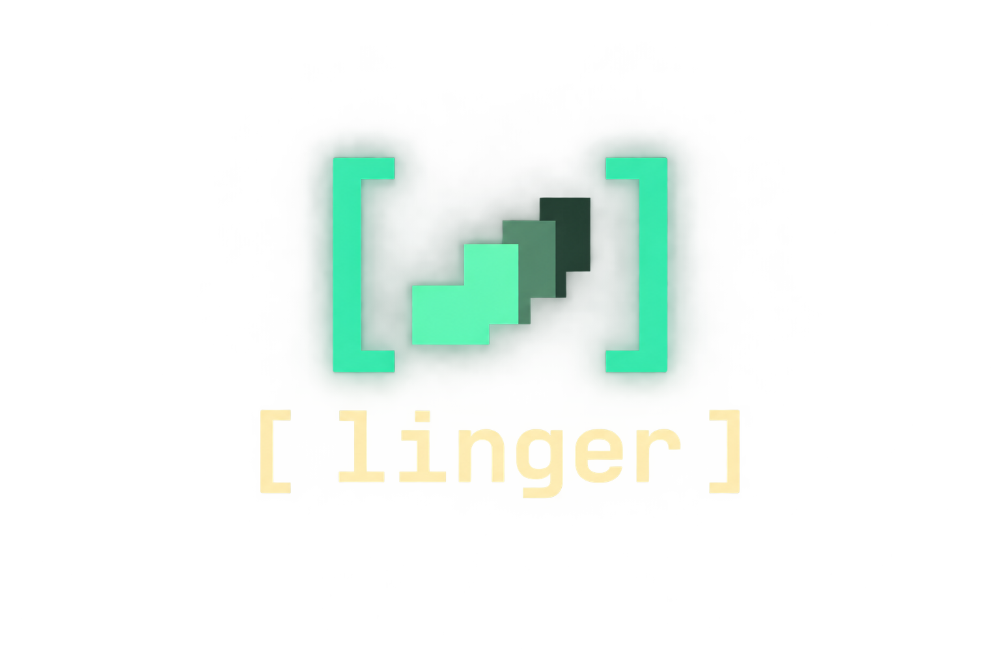

<p align="center">
  
</p>

# Linger

The agent ran it. Now make sense of it.

[](https://github.com/rickhallett/linger/actions/workflows/ci.yml)
[](https://github.com/rickhallett/linger/actions/workflows/website.yml)
[](https://www.rust-lang.org/tools/install)
[](LICENSE)

Linger is an open-source terminal viewer for Claude Code and Codex sessions. Follow a run live, move back through time, and drill into the exact inputs and recorded outputs of individual tool calls. Explore command parts against local documentation or ask Mercury to interpret the selected evidence.

Linger 0.1.0: live/replay inspection, optional local explainshell exploration, a session and cross-session pattern library, persistent learning states with Practising highlights, and a growing command field guide.

## Run

Install with Rust 1.88 or newer, or download an Apple Silicon or Intel macOS binary from [GitHub Releases](https://github.com/rickhallett/linger/releases/latest). The binaries are not Apple Developer ID signed or notarized. Linux binary distribution is still to be decided.

[Website and guide](https://lingerer.xyz) · [Release process](docs/RELEASING.md)

```sh
cargo install --git https://github.com/rickhallett/linger --tag runtime-v0.1.0 --locked
linger                         # newest session for the current project
linger /path/to/project        # follow another project
linger /path/to/session.jsonl  # replay a recording
linger <session-id> --follow    # start at the recorded live edge
linger inspect <file-or-id>     # headless session summary
```

A fictional demo is included in this checkout:

```sh
linger examples/repair.jsonl --follow
```

Press **Enter** to open the tool inspector. Pick a call with **j/k**, then **Enter** to focus its content. **Esc** returns one level. The original transcript is never modified, and no captured command is executed.

## Keyboard

| Key | Action |
|---|---|
| Enter | Graph → calls → content |
| b | Open/close the pattern library |
| G | Open/return from the field guide |
| w / p / L / u in inspector | Want / Practising / Learned / Unmarked |
| Esc | Content → calls → graph |
| j/k or ↑/↓ | Select calls, or scroll focused content |
| 1 / 2 | Recorded input / output |
| v | Toggle readable / raw payload view |
| W | Toggle word wrap (on by default in all inspector tabs) |
| 3 or e | Explore command parts (h/l steps between parts) |
| 4 | View interpretation for this evidence snapshot |
| i inside inspector | Ask Mercury about selected input/output |
| R inside inspector | Retry interpretation |
| / then Enter | Search the current content |
| n | Next search match |
| h/l or ←/→ | Select a command part; otherwise pan unwrapped content |
| PgUp / PgDn | Scroll content vertically |
| , / . | Previous / next recorded event |
| [ / ] | Previous / next prompt boundary |
| g or End | Return to the latest recorded event |
| Space | Pause/resume playback |
| s in graph | Toggle idle-gap compression |
| ? in graph | Graph controls and help |
| q / Ctrl-C | Quit (q is ordinary text during search) |

Input, Output, Command notes and Interpretation wrap to the pane width by default, including raw payloads. Wrapping preserves indentation and spacing; it only changes display rows. Press **W** for unwrapped content.

Live ingestion continues while the inspector is open. Selection and reading position stay fixed. Time navigation changes the evidence available: a later result is not shown at an earlier playhead.

## Command exploration

The command strip colours matched names green, options yellow, arguments blue and shell syntax purple. Unmatched spans use an underlined warm colour; the selected span keeps its filled highlight. The role legend and documentation heading use the same colours.

Install the optional local documentation pack once, then restart Linger:

```sh
uv run scripts/setup-explainshell.py
```

Open a call, press **3**, and use **h/l** to select command parts. The exact span stays highlighted while you read its documentation. Pipelines, flags and operands are matched locally using explainshell; unknown parts remain explicit. Simple quoted Python heredocs expose their shell wrapper while keeping the Python body opaque. Recognized shell argument arrays expose the inner command string; tab **1** always retains the original input.

The pack uses Ubuntu 26.04 manuals, which may differ from the execution host. The source path and extraction method are shown: local matching is deterministic over an LLM-built index. All indexed manpages in this pack were preprocessed by an LLM; option descriptions are sourced from the selected manual lines. Setup downloads about 220 MiB compressed; lookups are asynchronous and require no API key. See [setup, coverage and attribution](docs/COMMAND-EXPLORER.md).

## Pattern library

Press **b** from the graph or inspector. The library opens on **Parts**, ranking recurring programs, subcommands, flags, flag groups and composition operators across different full commands. It previews the constituent tokens in their original recorded context. The selected form is highlighted where it appears in the recorded input, including wrapper elements and commands inside quoted argument strings.

| Key in library | Action |
|---|---|
| Tab | This recording / all cached sessions |
| f | Cycle Parts → Combinations → Programs → Wrappers |
| c | Return directly to Parts |
| S | Include/hide inline scripts (hidden by default) |
| j/k or ↑/↓ | Select a pattern |
| h/l or ←/→ | Preview another occurrence in this recording |
| Enter | Jump to that occurrence’s last recorded event and pause |
| w / p / L / u | Want to understand / Practising / Learned / Unmarked |
| H | Show/hide Learned patterns (hidden by default) |
| / then Enter | Filter patterns and recorded examples |
| PgUp / PgDn | Scroll the preview |
| r | Refresh command counts from the local cache |
| b / Esc | Return to the previous view |

Inline code bodies are hidden from the default combination ranking. **S** includes them; a nonempty search also includes matching scripts. Original occurrences remain in the cache and inspector. Reusable interpreter and wrapper counts remain visible in their own levels.

**f** changes structural level. For `["/bin/zsh", "-lc", "rg -n needle src"]`, Programs counts `/bin/zsh` and `rg`; Wrappers counts `/bin/zsh -lc`; Combinations includes the wrapper with the command form and the inner `rg` form. Supported pipelines also expose their constituent command forms. A row counts **calls containing that form**, at most once per call. Rows overlap and must not be summed as unique calls. This is a bounded structural index, not every possible token subset.

Timeline keys **[/]**, **g/End**, **,/.** and **Space** work while Patterns is open. **?** shows its controls; Esc closes help before closing Patterns. While typing a search, those characters remain search text.

For example, two calls using `rg -n --hidden -g` with different globs and paths contribute to `rg`, `rg -n`, `rg --hidden`, `rg -g` and their flag group. `git diff --stat` contributes `git`, `git diff` and `git diff --stat`; pipelines contribute `shell |` and their individual command parts. Parts searches constituent names; other levels also search recorded examples. Known option values and arguments after `--` are excluded from flag counts. These are bounded syntactic groupings; unknown flag arity and arbitrary shell grammar remain outside the matcher.

Each row distinguishes **here**, **all cached occurrences**, and **distinct sessions**. Counts cover entire opened recordings, independent of the playhead. Replaying or reopening a call does not increment its count. The cache grows as you open sessions; Linger does not scan your unseen history. Cached-only patterns have a recorded input example; open the original recording to inspect its output.

Practising patterns carry a yellow **◎** in the inspector and replay timeline. Learned hides a pattern from the learning view, preserving every call in execution history. States are your explicit choices; Linger does not infer mastery or promote them automatically. Changes made by another running viewer appear on restart; `r` refreshes command counts.

Common `rg`, numeric `sed -n` printing, `git status`, and bounded `ssh` forms have conservative usage keys. Supported command compositions preserve their operators and order. Unsupported options, expansions, redirection and inline scripts keep exact input identities. These are browsing patterns, not a full shell parser or proof of semantic equivalence. Inline Python programs remain separate unless their exact input matches.

The local store defaults to `$XDG_DATA_HOME/linger/` or `~/.local/share/linger/`; `LINGER_DATA_DIR` overrides it. `patterns.sqlite3` retains command/tool input and occurrence identities; `learning.sqlite3` stores stable pattern keys, your learning choices, field notes and collected input specimens. Outputs are not copied into the pattern cache. These local files can contain private command arguments. They are not uploaded by the library. See [pattern storage and grouping](docs/PATTERN-LIBRARY.md).

## Field guide

Press **G** for your collected commands. **Drilling into a tool call collects that specimen**: Enter from the call list, opening an inspector content tab, or jumping to an occurrence from Patterns. Opening a recording or browsing call-list rows does not collect anything. Reopening the same call never adds a duplicate.

Each entry grows with the forms and highlighted inputs you have actually inspected, plus your own field note. Guide counts are collected specimens; frequency counts remain all recorded occurrences. Existing frequency history is not imported as a collection. Notes and learning choices are retained.

| Key | Action |
|---|---|
| h/j/k/l or arrows | Browse cards; in an entry, j/k selects forms and h/l cycles specimens |
| Enter | Open an entry, then inspect the selected occurrence's recorded output |
| G | Return to the previous view; reopen at the same entry |
| Esc | Back to the shelf, then return |
| / then Enter | Search command names, collected forms and your notes |
| Tab | All collected entries / entries collected from this recording |
| n | Edit the entry's field note; Enter saves, Esc cancels |
| w / p / L / u | Want to understand / Practising / Learned / Unmarked |
| PgUp / PgDn | Scroll the specimen |

Names that match your search come before entries with matching related forms. Inline programs appear as specimens under their interpreter; unique script bodies do not become separate forms. Learned entries remain in the guide. There are no prefilled, unencountered entries.

Collected specimens can be cycled across sessions. Those from the current recording can be opened in the inspector, where **3** explores the command; another recording must be opened separately to inspect its output. Notes are local, up to 4 KiB per entry. Both notes and collected inputs survive command-cache rebuilding. Changes from another running viewer appear after restarting. Browsing and note-taking make no model requests.

## Optional Mercury interpretation

Configure either `OPENROUTER_API_KEY` (default model `inception/mercury-2.5`) or `INCEPTION_API_KEY` (default model `mercury-2.5`). Linger reads a `.env` file in the launch directory, falling back to `$XDG_CONFIG_HOME/linger/.env` or `~/.config/linger/.env`. Set `LINGER_ENV_FILE` to choose an exact file. These files are parsed as data; no shell code runs and the process environment is not modified.

Process credentials take precedence over file credentials; if both providers exist in the same source, Inception wins. `LINGER_MODEL` overrides the model identifier (use the selected provider's naming). Keep credentials in the ignored `.env` or your private configuration, never tracked files.

Only an explicit **i** or retry action sends data. It sends the selected call's input and recorded output, plus bounded reference notes, to the selected provider: `https://openrouter.ai/api/v1/chat/completions` or `https://api.inceptionlabs.ai/v1/chat/completions`. Credentials are only sent to their matching host; redirects are disabled. Input and output are each limited to 48 KB for interpretation, with omissions labelled. This build does **not** scrub transcript secrets. Inspect sensitive material locally unless you intend to send it.

Requests run asynchronously with a timeout. Interpretations are cached in memory for the evidence snapshot and are not reused as current when output changes. Without a key or a working connection, inspection and replay still work. Provider response bodies are not printed on HTTP errors.

## What this version does and does not establish

- Preserves recorded Claude tool input/results and Codex function/custom-tool payloads. Codex command-completion records expose available command, cwd, exit and output fields.
- Displays structured content as JSON. Images are not rendered, and there is no recovery of output omitted or truncated by the provider.
- Offers local documentation-span selection through an optional explainshell backend, with bounded fallback notes when it is absent. Coverage is partial and sourced; embedded code remains code and can be interpreted contextually.
- Retains Zoetrope's transcript discovery, graph and replay foundation. Live output is only as current as the transcript; this is not direct process stdout capture.
- The pattern library and persistent learning states are implemented. Episode loops, deeper language exploration and opening cached-only recordings directly from the library remain future work. See [the roadmap](docs/LINGER-ROADMAP.md).
- A live Mercury 2.5 response through OpenRouter was verified using the fictional Python failure (13 September 2026). The explanation was visible within approximately 1.4 seconds while navigation stayed responsive. This single sample is not a latency or quality benchmark; direct Inception remains unverified live.

## Development

```sh
cargo fmt --check
cargo test --locked
cargo clippy --all-targets --locked -- -D warnings
cargo build --release --locked
# Optional native PTY check (requires uv):
uv run --with pyte python scripts/terminal-smoke.py
uv run --with pyte python scripts/pattern-smoke.py
uv run --with pyte python scripts/guide-smoke.py
uv run --with pyte python scripts/wrap-smoke.py
uv run --with pyte python scripts/parts-smoke.py
# With the optional local manpage pack installed:
python3 scripts/explainshell-check.py
uv run --with pyte python scripts/exploration-smoke.py
# Opt-in: one live provider request, using fictional evidence only:
uv run --with pyte python scripts/terminal-smoke.py --live-mercury
```

Tests cover upstream transcript/replay invariants and Linger's result preservation, time boundaries, stale interpretations, keyboard search, stable selection and a laptop-sized terminal render. Fixtures under `examples/` are fictional.

## Visual direction

Osaka Jade from Omarchy Quattro: deep green surfaces, muted jade focus, warm olive text and vermilion failures. A solid selection rail and filled active tab keep focus visible without relying on colour alone. The graph and timeline retain their layout; square frames and a quiet wordmark connect them to the inspector. Colours and shared frame/selection styles live in [src/ui/theme.rs](src/ui/theme.rs), so the visual language can evolve independently of replay and evidence handling. See [the design notes](docs/VISUAL-DESIGN.md).

## Attribution and licence

Linger is derived from [Zoetrope](https://github.com/furkankly/zoetrope), by Furkan Kalaycioglu, starting at commit `b1f31dd26bd4e9e513885e39edb78d0850a5d1fe`. Its graph, transcript adapters and replay engine are the foundation of this application. Linger's inspector, evidence retention and interpretation layer are additions. The original [MIT licence](LICENSE) is retained; Linger's additions are also MIT-licensed.

Command exploration can use a separately installed GPL-3.0 explainshell backend and its manpage database. Neither is vendored here; the external checkout retains its licence. See [the backend attribution and scope](docs/COMMAND-EXPLORER.md#attribution). Historical upstream documentation, browser code, integrations and release workflows (under `docs/upstream-workflows/`) are retained for provenance; they are not a promise of Linger browser or Herdr-plugin support. The internal library keeps the `zoetrope` name for now to avoid a mechanical rewrite of the inherited code.
